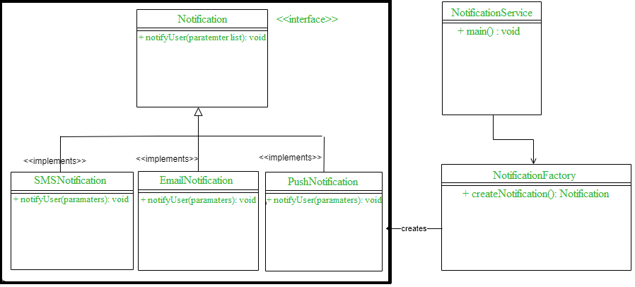

# Design Patterns

| Pattern                                                                                       | Type                | Examples                                                                                                                                                       | Interview evaluation                                                          | Description                                                                                                                                                                                                       |
|-----------------------------------------------------------------------------------------------|---------------------|----------------------------------------------------------------------------------------------------------------------------------------------------------------|:------------------------------------------------------------------------------|-------------------------------------------------------------------------------------------------------------------------------------------------------------------------------------------------------------------|
| :star: [Singleton](https://www.geeksforgeeks.org/singleton-design-pattern/?ref=lbp)           | Creational Patterns | - Redis caching and thread pool - Database connections - Config Manager  - Logging - Driver objects - Networking and Database Connectivity | Thread safe?  - Java - Use `synchronized`, static inner class, double checked locking  - Go - sync.once | Singleton ensures that only one object of its kind exists and provides a single point of access to it for any other code.                                                                                         |
| :star: [Factory Method](https://www.geeksforgeeks.org/factory-method-design-pattern-in-java/) | Creational Patterns | - DB factory (Postgres vs MySQL etc.)  - NotificationFactory - Frameworks - Payment Processor factory in ecommerce backend                         | Abstraction, Decoupling of object creation, from usage                        | Factory Method provides an interface for creating objects in a superclass, but allows subclasses to alter the type of objects that will be created.                                                               |
| :star: [Observer](https://www.geeksforgeeks.org/observer-pattern-set-1-introduction/)         | Behavioral Patterns | - GUIs - Messaging - Microservices - Reactive systems                                                                                              | Tests understanding of event driven systems and pub-sub models                | Observer lets you define a subscription mechanism to notify multiple objects about any events that happen to the object they’re observing.                                                                        |
| :star: [Strategy](https://refactoring.guru/design-patterns/strategy)                          | Behavioral Patterns | - Pluggable components (like recommendations, load balancing , eviction strategies)  - Payment Gateways - Sorting strategies - Compression algorithms         | Design design with interchangeable behaviors                                  | Strategy lets you define a family of algorithms, put each of them into a separate class, and make their objects interchangeable.                                                                                  |
| :star: Decorator Pattern                                                                      |                     | - Java I/O streams - UI Frameworks                                                                                                                         | Dynamically add responsibilities to objects without subclassing.              | Decorator pattern attaches additional responsibilities to an object dynamically.  - Decorators provide a flexible alternative to subclassing for extending functionality.                                     |
| :star: [Adapter Pattern](https://www.geeksforgeeks.org/adapter-pattern/)                      | Structural Patterns | - Integrate legacy code or external systems into new code base - API adapters to external systems (integrating with 3rd party api, legacy code)            | Compatibility, design flexibility                                             | Adapter is a structural design pattern that allows objects with incompatible interfaces to collaborate.                                                                                                           |
| :star: [Command Pattern](https://www.geeksforgeeks.org/command-pattern/?ref=lbp)              |                     | - Transactional or queue based systems - Job commands in task queue like Celery, SQS, Kafka                                                                | Design of undo/redo operations, request encapsulation                         | The command pattern encapsulates a request as an object, thereby letting us parameterize other objects with different requests, queue or log requests, and support undoable operations.                           |
| :star: [Facade](https://refactoring.guru/design-patterns/facade)                              | Structural Patterns | - API Gateways (expose simplified interface for complex microservices)                                                                                         | Simplify complex systems with clean APIs                                      | Facade provides a simplified interface to a library, a framework, or any other complex set of classes.                                                                                                            |
| :star: [Builder](https://refactoring.guru/design-patterns/builder)                            | Creational Patterns | - Optional parameters, immutability - Configuration heavy objects (complex request builders, query builders etc.)                                          | Creating complex objects step-by-step without telescoping constructor         | Builder is a creational design pattern that lets you construct complex objects step by step. The pattern allows you to produce different types and representations of an object using the same construction code. |
| [Abstract Factory](https://refactoring.guru/design-patterns/abstract-factory)                 | Creational Patterns |                                                                                                                                                                |                                                                               | Abstract Factory is a creational design pattern that lets you produce families of related objects without specifying their concrete classes.                                                                      |

# Sample Implementations

| Programming Language                                               |
|--------------------------------------------------------------------|
| [Go](https://github.com/Anshul619/golang/tree/main/DesignPatterns) |
| [Java](https://github.com/Anshul619/Java/tree/main/DesignPatterns) |

# Factory pattern

# Adapter pattern

# MVC Design Pattern
The Model View Controller (MVC) design pattern specifies that an application consist of a data model, presentation information, and control information.

The pattern requires that each of these be separated into different objects.
- The `Model` contains only the pure application data, it contains no logic describing how to present the data to a user.
- The `View` presents the model’s data to the user. The view knows how to access the model’s data, but it does not know what this data means or what the user can do to manipulate it.
- The `Controller` exists between the view and the model. It listens to events triggered by the view (or another external source) and executes the appropriate reaction to these events. In most cases, the reaction is to call a method on the model. Since the view and the model are connected through a notification mechanism, the result of this action is then automatically reflected in the view.

# Template pattern
- It is part of `Behavior Design Pattern` type.
- The template pattern defines the skeleton of an algorithm in an operation deferring some steps to sub-classes.
- The template method lets subclasses redefine certain steps of an algorithm without changing the algorithm structure.
- [Read more](https://www.geeksforgeeks.org/template-method-design-pattern/)

# Constructor Chaining
- Constructor chaining is the process of calling one constructor from another constructor with respect to current object.
- [Read more](https://www.geeksforgeeks.org/constructor-chaining-java-examples/)

Constructor chaining can be done in two ways:
- Within same class: It can be done using this() keyword for constructors in same class
- From base class: by using super() keyword to call constructor from the base class.

Rules of constructor chaining :
- The `this()` expression should always be the first line of the constructor.
- There should be at-least be one constructor without the `this()` keyword (constructor 3 in above example).
- Constructor chaining can be achieved in any order.

# Iterator Pattern
- The iterator pattern provides a way to access the elements of an aggregate object without exposing its underlying representation.

# References
- [Factory method for designing pattern](https://www.geeksforgeeks.org/design-patterns-set-2-factory-method/?ref=leftbar-rightbar)
- [Constructor Chaining In Java with Examples](https://www.geeksforgeeks.org/constructor-chaining-java-examples/)
