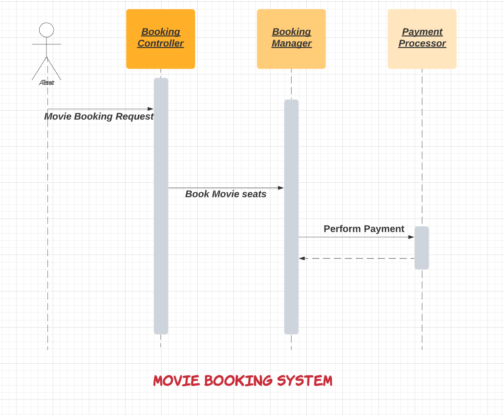
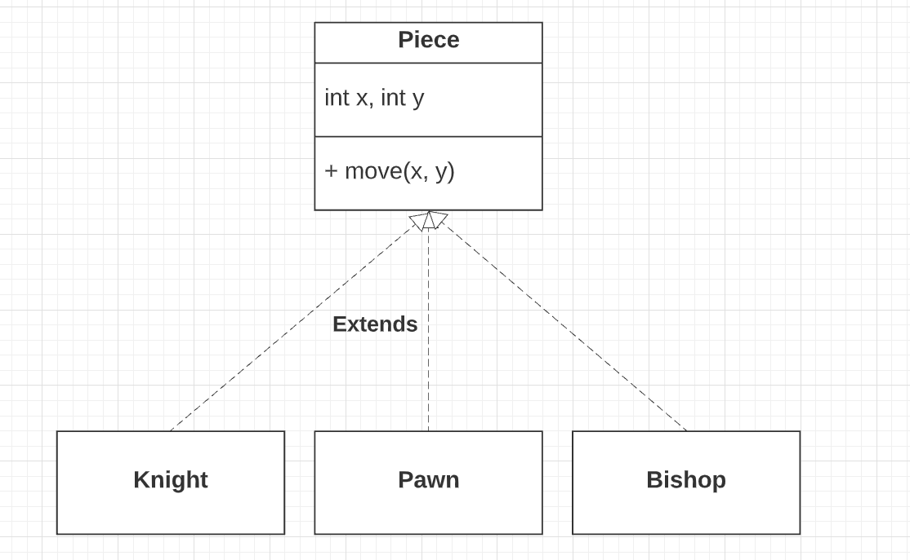

# OOP Design - Tips & Techniques

# Requirements Gathering
- What are use cases? What are business actors?
- Every requirement will translate into action (`methods`) in the system.
- Think from `user perspective` & `use cases`.

# Choose Language
- Ask if you can use golang for LLD design. But be prepared with java OOP design if interviewer say no.

Even if you're allowed to use Go, think in OOP terms during LLD:
- Model entities (e.g. ParkingLot, Slot, Vehicle) using structs + interfaces
- Mimic patterns like [Strategy](DesignPatterns/Readme.md), [Factory](DesignPatterns/Readme.md), or [Observer](DesignPatterns/Readme.md).
- Show how you'd structure code for testability, extensibility, and clean separation of concerns

# Object Modelling
- Define `composition` & `relationship` b/w entities
- Establish the relationships between the classes / objects by observing the interactions among the classes / objects.
- This is important perspective.
- Most of the classes would have a composition with another domain class. This is natural.

# Define Main & Core Classes/Entities
- Make sure [SOLID](SOLID.md) principals are followed.
- Think of as many smaller & unit classes as possible.
- A single feature might involve interaction between multiple entities.
- Examples
    - In the case of a movie booking application, the booking will involve components such as `BookingController`, `BookingManager`, and `PaymentProcessor`.
    - `BookingController` will handle the booking requests and send a request to the `BookingManager` to book movie seats.
    - `BookingManager` will then interact with the `PaymentProcessor` for completing the payment.

# Define abstract classes
- Common, reusable classes which can be extended for various business Actors, UCS etc.
- Examples
    - `User Account` abstract class ( with first name, last name etc. ) can be extended for different user actors ( `Employee`, `Manager` etc. ).
    - `Piece` abstract class ( with `move()`) in the chess game ( for pawn, knight, bishop classes ).

# Define interfaces
- Interfaces are core entities which can be implemented as per the needs.
- Examples
    - `Search` interface

# Define enums
- `Enums` are different types of entities which are hardcoded but at one place.
- Examples
    - `Payment status`
    - `entity status`
    - `reservation status`
    - `booking status` etc.

# References
- [How to Ace the Low-level Design Interviews](https://betterprogramming.pub/how-to-ace-the-low-level-design-interview-3f1be6401070)